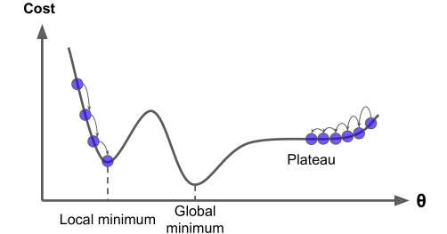
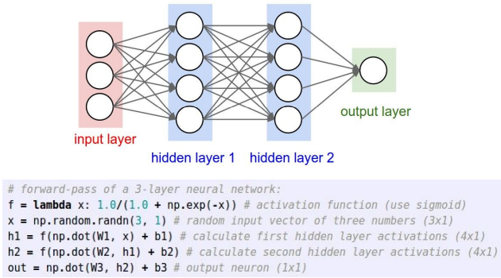

# Deep Learning
Deep learning algorithms are inspired by the structure and function of the human brain, allowing machines to learn from vast amounts of data, recognize patterns, and make accurate predictions. From image and speech recognition to natural language processing and autonomous vehicles, deep learning is everywhere these days. I will try to cover the most talked about topics in this chapter.
# Loss Function
As discussed vastly in [Machine Learning chapter](https://github.com/nvmcr/DataScience_HandBook/tree/main/Machine_Learning), a loss function is something that tells us how well our model is working. In deep learning, we will most look into classification cases. Multiclass SVM (also called hinge loss) and Softmax Loss.
## Multiclass SVM
It is the same loss function used in SVMs for multi-class classification. Say we have a classifier and scores vector is, $s=f(x_i, W), then the loss is given as:

$$ L_i = \Sigma_{j\neq y_i} max(0, s_j-s_{y_i}+1) $$

Here $y_i$ is the correct label. The main aim of this loss function is to have the highest score in $s_{y_i}$. If it doesn't have the highest scores, loss is given as the difference between an actual class score and sum of all other classes scores.

Ex: Say we have a *cat* image and our scores vector looks like this:

|Class|Score|
|---|--|
|cat|3.2|
|car|5.1|
|frog|-1.7|

The loss is calculated as $max(0, 5.1-3.2+1) + max(0, -1.7-3.2+1) = 2.9$ Loss is calculated for the classes other than the actual class.

We generally added regularization like L1 or L2 to the loss function.

## Softmax Loss
Scores given by hinge loss don't mean much. Those are just some arbitrary values. But softmax loss given scores as probabilities for better interpretation. 

Same as before we have scores like 3.2 for cat. This is passed through an exponential function and then is normalized by the sum of the exponential value of all classes. This exponential and normalizing is called softmax function, $P(Y=k|X=x_i) = \frac{e^{s_k}}{\Sigma_j e^{s_j}}$. The final loss is given by $L_i=-logP(Y=y_i|X=x_i)$ which is nothing but doing cross-entropy loss for a softmax function. 

In general, people call this loss as cross-entropy loss too. But it is actually cross-entropy loss for a softmax function.
# Optimizer
Using the loss function we get to know how our model is working. But to make our loss less or make our model work well we have to optimize our weights. Optimizers are the functions used to optimize our weights. We already discussed gradient descent(GD) and its variants in machine learning chapter. So we will discussed few advanced optimizers here.

## GD Pitfalls
Not all convex functions are good for GD. There are non-smooth functions that have sharp corners where function is not differentiable.
> The derivative of a function at a point is defined as the slope of the tangent line to the function at that point.

A subgradient is the gradient at a point on the function. At the sharp corners, there can be multiple tangents leading to multiple subgradients at a single point. This makes convergence go crazy.

Other two main challenges with Gradient Descent are local minima's, saddle points and plateau. 

If the random initialization starts the algorithm on the left, then it will converge to a local minimum, which is not as good as the global minimum. If it starts on the right, then it will take a very long time to cross the plateau (flat regions), and if you stop too early you will never reach the global minimum. 

Saddle points are not local minima. They are the points where in one direction loss goes up and in other loss goes down making gradient at the point zero. But the point is not local or global minima. Our GD can't get out of saddle point regions.

Most of these pitfalls are common for deep learning models as we have large number of dimensions involved in optimization. So most of the below discussed optimizations are used in deep learning.
## SGD with Momentum
This is a technique used to accelerate the convergence of the optimization process by adding a fraction of the previous gradient to the current gradient estimate. The idea is to allow the optimization algorithm to build up speed in directions that have consistent gradients and to dampen oscillations in directions with inconsistent gradients thus passing local minima with velocity gathered from rolling down the hill. Similarly crossing saddle points and plateaus (flat regions).

Specifically, at each iteration of the SGD algorithm with momentum, the gradient is computed on a small subset of the training data (a mini-batch), and then a "velocity" vector is updated by adding a fraction (the momentum coefficient or $\rho$) of the previous velocity vector to the current gradient estimate. The parameters of the model are then updated by subtracting the updated velocity vector from the current parameter estimate.

The momentum coefficient is typically set to a value between 0 and 1, usually 0.9 with higher values leading to more momentum and faster convergence, but potentially overshooting the optimal solution.

for t=1,...T do

  for i=1,...n do

$v \leftarrow = \rho v + (y^i - w^Tx^i)x^i$

$w \leftarrow w + \alpha v$

return w

But, we if observe we have two hyperparameters now, $\rho$ and $\alpha$. They need tuning to get the best results.
## AdaGrad
AdaGrad, which stands for Adaptive Gradient, is an optimization algorithm that is designed to automatically adapt the learning rate during training. 

During training, AdaGrad maintains a set of per-parameter gradient accumulators, which are initialized to zero. At each iteration, the gradient of the loss function with respect to the parameters is computed, and the accumulated sum of the squared gradients for each parameter is updated as follows: $grad accumulator += gradient^2$. The parameter is calculated as:

$$ parameter -= \frac{initial learning rate}{\sqrt{grad accumulator} + offset to avoid zero}* gradient $$

The negative sign is turned into positive by the gradient (negative gradient means going down the slope). The initial learning rate is generally set to 0.1 or 0.01 but it doesn't matter because it is adaptively scaled. Adagrad even address issue in higher dimensional space where one parameter converges faster than the other.

In Adagrad, as the gradient decreases, the step size keeps decreasing as we approach convergence which is useful in convex but if there is a saddle point or flat, then the optimization becomes super slow.
## RMSProp
This is an updated version of Adagrad.

$$ grad acc = decay rate * grad acc + (1 - decay rate) * gradient^2 $$

$$ parameter -= \frac{initial learning rate}{\sqrt{grad accumulator} + offset to avoid zero}* gradient $$

The first line of the update rule computes the moving average of the squared gradients using an exponential decay, which is a hyper-parameter usually set to 0.9. This effectively scales down the learning rate for parameters with large gradients and scales up the learning rate for parameters with small gradients. Thus giving us smoother convergence.
## Adam
Perhaps the most used optimizer for neural networks. Adam, short for Adaptive Moment Estimation, is a popular optimization algorithm in machine learning that combines ideas from both RMSprop and momentum-based gradient descent. It is an adaptive learning rate optimization algorithm, which means it adjusts the learning rate of each parameter based on the history of the gradients for that parameter. 

The Adam algorithm maintains a set of exponentially decaying average of past gradients and past squared gradients for each parameter. The decaying rate of the averages is controlled by two hyperparameters, $\beta_1$ and $\beta_2$, which are typically set to 0.9 and 0.999, respectively. The average of past gradients is used to calculate the momentum term, while the average of past squared gradients is used to calculate the scaling term. These two terms are then combined to obtain the update for each parameter.

Say the computed gradient of loss function be $dx$ and first and second moment are set to zero initially.

$$ first moment = \beta_1\*first moment + (1-\beta_1)\*dx $$

$$ second moment = \beta_2\*second moment + (1-\beta_2)\*dx\*dx $$

$$ parameter -= \frac{\alpha*first moment}{\sqrt{second moment} + offset} $$

Adam also includes a bias correction mechanism that corrects for the fact that the estimates of the first and second moments are biased towards zero, especially in the early stages of training when the estimates are very inaccurate.
# Neural Networks
Let's consider a supervised image classification. Using a linear classifier is not enough for images as they don't capture more than one template. It's important that we use a nonlinear classifier. For many years in the field of computer vision, people tried different approaches to extract/learn features of images using techniques like Histogram of Oriented Gradients (HOG), Bag of Words, etc. But most of them are not effective except neural networks. 

Neural networks are a bunch of linear classifiers with activation functions in between. Activation functions are nonlinear functions. Without these, the neural network is just a linear classifier. 

In a neural network, there is an input layer, an output layer, and any number of hidden layers in between. Each hidden layer consists of neurons. We try to learn the weights/parameters of these neurons. See the below image to know what happens in a fully connected neural network/multi-layer perception. 

Each input is multiplied (dot product) by the weight of each neuron. This dot product is made nonlinear by passing through the activation function. This output of one hidden layer is passed as the input to the next hidden layer. Each hidden layer will have a bias term just as we have in any other model. (Bias term is to have the offset/intercept as not every function is symmetrical around the origin). The more neurons and layers the more powerful the network is but beware of overfitting and use regularization effectively. 
## BackPropagation
In order to optimize, if we use gradient descent for neural networks, then we have to derive the gradient for weight matrices of each layer, and computing gradients become too complex. The better idea is to use the technique called backpropagation. Watch the [video](https://youtu.be/Ilg3gGewQ5U) by 3Blue1Brown for a visual understanding of backpropagation. Let's see the mathematical implementation of backpropagation.

Here we have a fully connected 2-layer neural network with layers represented with $a^{layer_num}$, input later being $a^1$, the last hidden layer is $a^l$ and the output layer is $a^{l+1} and weight matrix of layer $l$ are represented as $\theta^{l-1}$. The input $x$ is a single sample image from our dataset.

In the forward pass,

$$ a^1 = x $$

$$ z^2 = \theta^1 a^1 $$ 

$$ a^2 = g(z^2) $$ 

$$ a^l = g(z^l) $$

$$ z^{l+1} = \theta^l a^l $$

$$ a^{l+1} = g(z^{l+1}) = \hat{y}$$

where $g(z) = \frac{1}{1+e^{-z}} $$ which is a sigmoid activation function. 

Backpropagation:

We will chose loss function as a categorical cross entropy $L(y,\hat{y}) = ylog(\hat{y}) + (1-y)log(1-\hat{y})$. We need to optimize the weights and biases. For now, I am removing bias terms as it is handled in the same way as weights. To know in which direction the weights should move, we do gradients. So in the backward pass, we have to find $\frac{\partial L(y,\hat{y})}{\partial \theta_{i,j}^l}$

# References
1. [Deep Learning by Ranjay Krishna and Aditya Kusupati](https://courses.cs.washington.edu/courses/cse493g1/23sp/schedule/)
2. [Machine Learning CSE 446 UW](https://courses.cs.washington.edu/courses/cse446/22au/)
