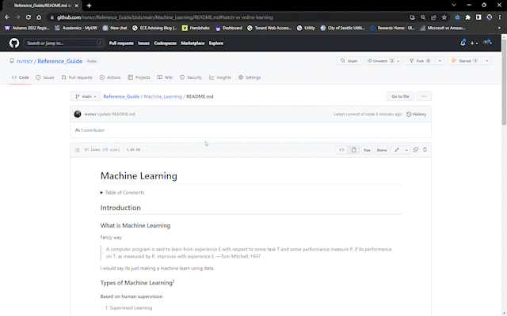

Table of Conetents

## Table of contents
Please use the github's interactive navigation. (Too lazy to write/generate TOC)

# Limit Theorems
## Sample Mean
Let $X_1$,.. $X_n$ be a sequence of iid random variables. The sample mean is given by

$$ S_n = {1\\over n}{\sum_{i=1}^n X_i} $$
## Weak Law of Large Numbers
$$ \lim_{n\to\infty} P(|S_n-\mu|>k)=0 $$

As the sample size n approaches infinity, the sample mean **converges in probability** to the true population mean. This means that as the sample size gets larger and larger, the probability that the sample mean deviates from the true population mean by more than k approaches zero.
## Strong Law of Large Numbers
$$ P(\lim_{n\to\infty} S_n = \mu) = 1 $$

As sample size n approaches infinity, the sample mean **converges almost surely** to mean. This provides a theoretical justification for the use of sample means as unbiased estimators of population means.

For example, a coin might land on heads 5 times in a row, but over a much larger n we would expect the proportion of heads to be approximately half of the total flips. Similarly, a casino might experience a loss on any individual game, but over the long run should see a predictable profit over time.
## Central Limit Theorem
It states that if we repeatedly sample a random variable a large number of times, the distribution of the sample mean will approach a normal distribution regardless of the initial distribution of the random variable.

$$ S_n = {{X_1+X2+...X_n}\\over n} \sim N(\mu,{\sigma^2\\over n}) $$

In other terms,

$$ {(S_n - \mu)\\over \sqrt(n\sigma^2)} \sim N(0,1) $$
# References
The information is pulled from various sources from internet. Major sources are:
1. [Practical Statistics for Data Scientists](https://www.oreilly.com/library/view/practical-statistics-for/9781491952955/)
5. [Ace the Data Science Interview](https://www.acethedatascienceinterview.com/)
6. ChatGPT :)
